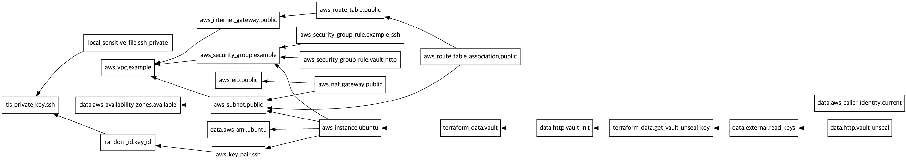

# Terraform Provisioning: step-by-step dependencies

This repository provides Terraform configurations and scripts to provision an AWS infrastructure and automate the installation and initialization of HashiCorp Vault. The workflow is designed with step-by-step dependencies and retries to ensure robustness.

## Prerequisites

### Software Requirements
- Terraform
- Bash (for executing `read_keys.sh`)

### AWS Resources Required
- Access to an AWS account with appropriate permissions to create VPCs, subnets, EC2 instances, and related resources.
- Existing SSH public and private key for EC2 instance access.

---

## Step-by-Step Process



### 1. Provisioning AWS Infrastructure
- Creates the following AWS resources:
  - **VPC**: A virtual private cloud with DNS support and hostnames enabled.
  - **Subnet**: A public subnet with a CIDR block of `10.0.0.0/24`.
  - **Internet Gateway**: For public internet access.
  - **Route Table**: Configures routes to direct traffic via the internet gateway.
  - **Security Group**: Allows inbound SSH (port 22) and Vault HTTP traffic (port 8200).
  - **EC2 Instance**: An Ubuntu instance with a generated SSH key pair.

### 2. Installing HashiCorp Vault
- Provisions Vault on the EC2 instance using the `terraform_data.vault` resource.
- Installs Vault with necessary dependencies and configures it to start on boot.

### 3. Initializing Vault
- Sends an HTTP POST request to the `/v1/sys/init` endpoint of the Vault server.
- Ensures retries using the `data.http` resource to handle delays in Vault readiness.
- Stores the unseal key and root token in local files (`vault_unseal_key` and `vault_root_token`).

### 4. Unsealing Vault
- Executes a script (`read_keys.sh`) to retrieve the unseal key and root token.
- Sends the unseal key to Vault’s `/v1/sys/unseal` endpoint via an HTTP POST request.

---

## Key Components

### `main.tf`
Contains the Terraform configurations for AWS resources and Vault installation. Highlights include:
- **Dependencies**: Ensures resources are provisioned in the correct order using `depends_on`.
- **Retries**: Handles delays with the `retry` block in the `data.http` resource.
- **Provisioners**: Uses `remote-exec` for remote commands and `local-exec` for local operations.

### `read_keys.sh`
A Bash script that:
- Waits for the `vault_unseal_key` and `vault_root_token` files to be created.
- Reads these keys and outputs them in JSON format for Terraform to use.

---

## How to Use

1. **Clone the Repository:**
   ```bash
   git clone <repository-url>
   cd <repository-directory>
   ```

2. **Initialize Terraform:**
   ```bash
   terraform init
   ```

3. **Apply Terraform Configuration:**
   ```bash
   terraform apply
   ```
   Confirm the action and wait for the provisioning process to complete.

4. **Monitor Progress:**
   - Check for any delays or issues in the provisioning process.
   - Ensure the Vault instance is running and accessible at `https://${aws_instance.ubuntu.public_ip}:8200`.

5. **Post-Provisioning Steps:**
   - Verify the `vault_unseal_key` and `vault_root_token` files in the working directory.
   - Use these keys to manage Vault.

---

## Notes

- Ensure your AWS credentials are configured correctly for Terraform to access your AWS account.
- The infrastructure and Vault setup are designed for demonstration purposes. For production environments, additional security configurations (e.g., restricted CIDR blocks, IAM roles) are recommended.
- The `retry` mechanism is configured with a high number of attempts to accommodate network delays. Adjust this if needed.

---

## Troubleshooting

### Common Issues
- **HTTP 500 Errors on Vault Endpoints**: Ensure the EC2 instance is reachable and Vault is running.
- **SSH Connection Failures**: Verify the generated SSH key pair and security group rules.
- **Missing Files (`vault_unseal_key`, `vault_root_token`)**: Check Terraform logs and ensure the provisioning scripts ran successfully.

---

## Cleanup
To remove all resources created by this configuration:
```bash
terraform destroy
```
Confirm the action to delete all resources.

---

## License
This project is licensed under the MIT License. See the LICENSE file for details.

